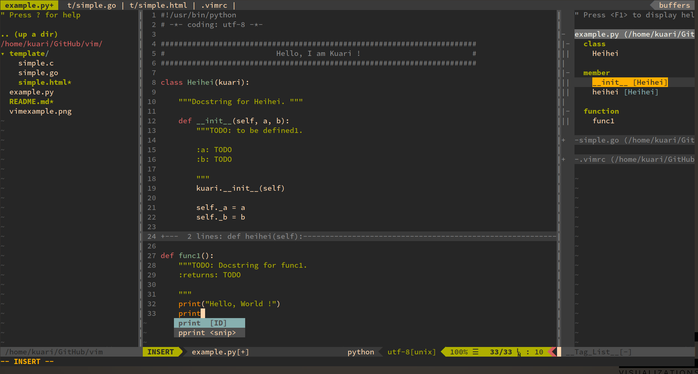

## Kuari的vim配置文件

### 截图

### 插件

* Plug 'Valloric/YouCompleteMe'
* Plug 'flazz/vim-colorschemes'
* Plug 'vim-airline/vim-airline'
* Plug 'vim-airline/vim-airline-themes'
* Plug 'junegunn/vim-easy-align'
* Plug 'scrooloose/nerdcommenter'
* Plug 'tpope/vim-surround'
* Plug 'mattn/emmet-vim'
* Plug 'scrooloose/syntastic'
* Plug 'easymotion/vim-easymotion'
* Plug 'SirVer/ultisnips'
* Plug 'honza/vim-snippets'
* Plug 'kuari/i3window_sw'
* Plug 'Yggdroot/indentLine'
* Plug 'alvan/vim-closetag'
* Plug 'jiangmiao/auto-pairs'
* Plug 'terryma/vim-expand-region'
* Plug 'scrooloose/nerdtree', { 'on':  'NERDTreeToggle' }
* Plug 'vim-scripts/taglist.vim'
* Plug 'ap/vim-css-color'
* Plug 'kien/ctrlp.vim'
* Plug 'majutsushi/tagbar'
* Plug 'terryma/vim-multiple-cursors'
* Plug 'jvanja/vim-bootstrap4-snippets'
* Plug 'othree/html5.vim'
* Plug 'vim-scripts/indentpython.vim'
* Plug 'maksimr/vim-jsbeautify'

### 插件介绍

| 插件名 | 功能 | 快捷键（简略） |
| ------ | ------ | ------ |
| YouCompleteMe | 自动补全 | |
| vim-colorschemes | vim配色 | |
| vim-airline | vim状态栏 | |
| vim-airline-themes | vim状态栏主题 | |
| vim-easy-align | 快速对齐 | ,a + 按键 |
| nerdcommenter | 快速注释 | 注释,cc 反注释,cu |
| vim-surround | 处理成对出现的“包围结构” | shif+s+括号 cs+括号+括号 ds+括号 |
| emmet-vim | 快速创建html标签 | Ctrl+y+, |
| syntastic | 语法检查 | |
| vim-easymotion | 快速跳转 | ,f+字符 |
| ultisnips | 代码片段补全 | Ctrl+x Ctrl+c |
| vim-snippets | 代码片段仓库 | |
| i3window_sw | i3-wm window与vim window 分离与合并 | 分离F7 合并F8 |
| indentLine | 竖对齐线 | |
| vim-closetag | html标签自动合并 | |
| auto-pairs | 自动补全括号 | |
| vim-expand-region | 区域选中 | |
| nerdtree | 文件浏览 | F3 |
| taglist.vim | 代码符号的结构化视图 | F4 |
| vim-css-color | css颜色显示 | |
| ctrlp.vim | 文件搜索 | Ctrl+p |
| tagbar | 大纲导航 | F9 |
| vim-multiple-cursors | 多光标操作 | Ctrl+n, Ctrl+p |
| vim-bootstrap4-snippets | BootStrap4代码块 |  |
| html5.vim | HTML5增强 |  |
| indentpython.vim | Python缩进增强 |  |
| vim-jsbeautify | 格式化html、css、js文件 | Ctrl+f |

##### 注：相关插件的介绍与作用还需要去相应的主页了解。

### 其他功能

* 插件管理为`vim-plug`
* vim配色为`gruvbox`
* airline主题为`biogoo`
* 字体为`mononki`
* `tab`键在特定文件下分别映射为4和2个空格
* `Ctrl+d/u`滚屏
* `Ctrl+hjkl`切换分屏
* 命令模式下光标当前行高亮
* 映射`jk`连摁为`Esc`
* 空格折叠代码
* 使用系统剪切板
* 显示句末空白格,映射快捷键使其全部去除
* 映射`F2`显示系统剪切板
* 81列处显示提醒
* 搜索结果即时显示
* 切换缓存不需要保存
* 缩写快捷显示名字、邮箱等信息
